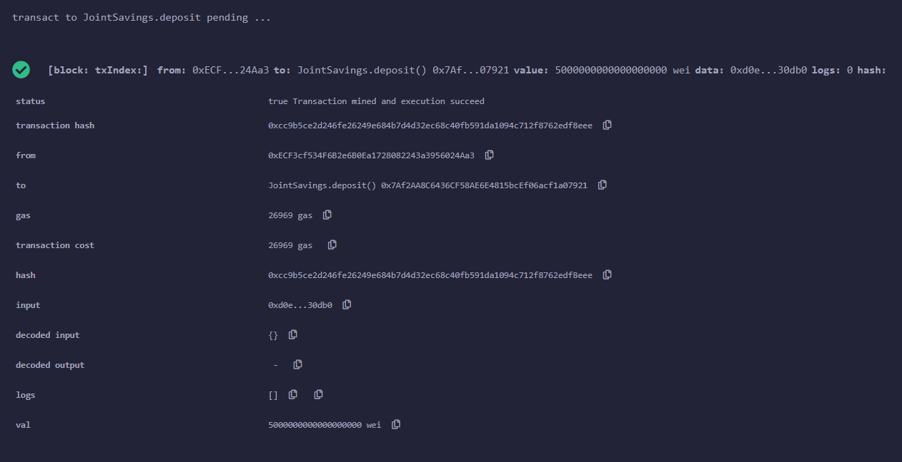

# module_20_challenge
# Joint Savings Contract
We are creating a contract for a joint savings account using Ether. This contract will allow you to deposit funds in transfer and withdraw. 
-------------------------------------------------------------------------------------------------------------------------

## Technologies Used
We used Solidity 0.5.0, MetaMask, and Ganache.  
-------------------------------------------------------------------------------------------------------------------------

## Installation
We will need to install MetaMask a google chrome extension and Ganache to get test accounts. 
-------------------------------------------------------------------------------------------------------------------------

## Example
We deploy the contract deposit funds in set the accounts and then we can take funds out or transfer to another account. This contract will also tell you its balance in the contract who was the last to withdraw and how much was taken out.
-------------------------------------------------------------------------------------------------------------------------

## Images

Depositing 1 Eth

Depositing 5 Eth

Depositing 10 Eth

Set accounts

Deployed Contract

Last Withdraw example

